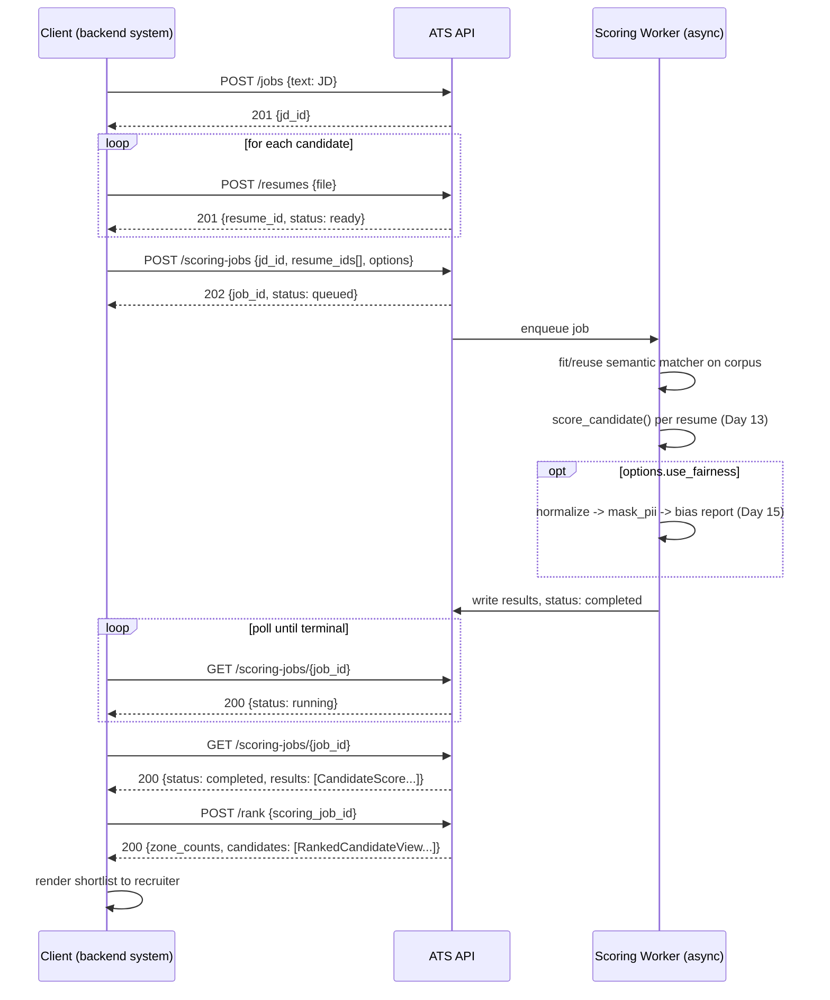

# Day 16 — Integration Flow Document

How a backend system (recruiter dashboard, ATS integration, etc.) actually
drives the API end to end, and how the async scoring job state machine works.

## End-to-end flow



## Async scoring job state machine

```
   POST /scoring-jobs
          │
          v
      [queued] ──cancel──> [cancelled]
          │
          v
      [running] ──cancel──> [cancelled]
          │
     ┌────┴────┐
     v         v
[completed]  [failed]
```

- **queued → running**: worker picks up the job. `started_at` is set.
- **running → completed**: all `resume_ids` scored successfully.
  `results` populated, `completed_at` set.
- **running → failed**: an unrecoverable error (e.g. `jd_id` deleted
  mid-job, corpus fit exception). `error` populated with a human-readable
  cause; the underlying exception goes to structured logs under the same
  `request_id`/`job_id`, not into the API response.
- **queued/running → cancelled**: explicit `POST /scoring-jobs/{id}/cancel`.
  A job already `completed`/`failed` returns `409` on cancel — you can't
  cancel something that already finished.
- Terminal states (`completed`, `failed`, `cancelled`) never transition
  further. A client polling past a terminal state just keeps getting the
  same status back — no special handling needed.

**Polling guidance**: start at ~1s intervals, back off (e.g. to 5s) after
the first few polls for larger batches. A `Retry-After` header on the
`202`/`200` responses while `status` is non-terminal is the intended
signal for how long to wait before the next poll, rather than a client
guessing.

## Why this shape, not a webhook

Webhooks were considered and deliberately deferred — they need a
registered callback URL, retry/backoff handling, and signature
verification, none of which exist yet in this project's infrastructure.
Polling is strictly worse for very large batches but is the honest choice
given what's actually built today; the job resource (`GET
/scoring-jobs/{id}`) is designed so a webhook could be added later
without changing the resource shape — it would just be an additional
notification on the same state transitions.

## Real finding surfaced during validation

While validating `schemas/ats_api_schemas.json` against real Day 15
output (`data/results/fairness_report.json`), `validate_day16_spec.py`
caught that `run_fairness_check.py` (Day 15's internal debug script)
serializes `BiasReport.pii_fields_detected` under the key
`fields_detected` — a readability choice in that script that doesn't
match the dataclass field name. The schema here follows the dataclass
(the correct source of truth for an API contract); **a real
implementation of `GET /scoring-jobs/{id}` must emit
`pii_fields_detected`**, not copy `run_fairness_check.py`'s internal
naming. Flagging this now, before any endpoint is actually built, is
the entire point of doing a schema-design pass ahead of implementation.

## What this flow deliberately does not cover

- Authentication/session handling between client and API.
- Where `resume_ids`/`jd_id` are actually persisted (database choice)
  — out of scope for an API design day.
- Retry behavior for a client that loses its `job_id` (e.g. a
  "list scoring jobs" endpoint) — not yet designed, worth a follow-up day.
